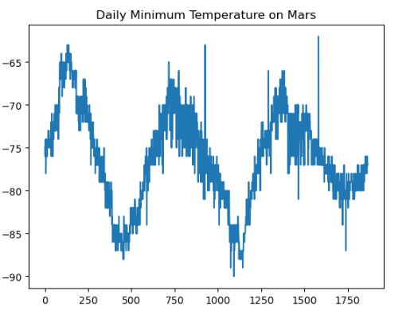

# CSS Flask Scraping Analysis

## Website: 
[website](https://github.com/Rock-Roll1968/Scraping-Analysis.git)

## Description
Mars Temperature and Atmospheric pressure Analysis 

## Table of Contents
- [Installation](#installation)
- [Usage](#usage)
- [Credits](#credits)
- [License](#license)
- [Features](#features)

- [Contact](#contact)

## Installation
Jupyter Notebook, CSV, Python, MATPLOTLIB, Splinter, Pandas, Beautiful Soup

## Usage
Run ipynb files

## Credits
Ernesto V Garcia

## License
MIT

## Features
HTML Data analysis with bar charts

## Contact
If there are any questions or concerns, I can be reached at:
##### [github: ROCK-ROLL1968](https://github.com/ROCK-ROLL1968)
##### [email: ernesto.v.garcia@outlook.com](mailto:ernesto.v.garcia@outlook.com)
